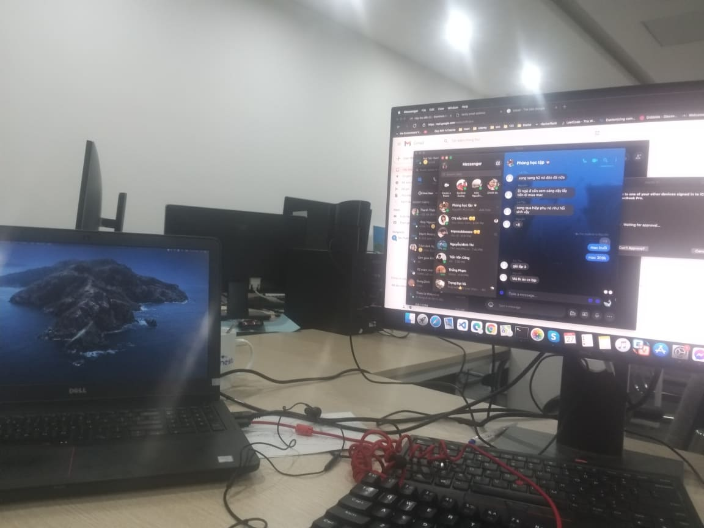

# Personal Hackintosh Guide/ Dell 7559
### Screenshot

### Notes
 - Card wifi intel không ổn định
 - Bluetooth sử dụng tốt.
 - Fix wifi bằng usb comfast cf811-ac
### Cấu hình :
 - Intel i7-6700HQ CPU
 - Intel HD Graphics 530
 - NVIDIA GTX 960M 
 - Comfast cf811-ac USB WIFI
 - 16GB 1600MHz DDR3 RAM
 - 15.6” FHD (1920x1080) Display
 - 250 GB SSD (Sata)

### Cài đặt Bios
 - Disable Secure Boot

# Tạo bộ cài

## Tạo bộ cài trên MacOS

- Tải xuống bộ cài MacOS Catalina từ các nguồn, đuôi dmg.
- Vất vào Applications rồi làm theo hướng dẫn tạo bộ cài lên USB bằng bài viết này:
https://blogchiasekienthuc.com/hackintosh/tao-usb-cai-hackintosh-voi-clover-bootloader.html

## Tạo bộ cài trên Windows

- Tải xuống bộ cài MacOS Catalina từ các nguồn, đuôi raw.
- Dùng thằng Etcher hoặc Win32 Disk Imager để ghi lên USB.
- Cá nhân mình dùng Etcher vì nó dễ dùng giao diện đẹp.

## Chuẩn bị EFI trên ổ cứng dể boot vào bộ cài từ USB

- Dùng win pe và sử dụng công cụ minitool partition wizard 12.
- Ổ cứng để địng dạng GPT
- Tạo phân vùng FAT32 tên EFI MAC = 210 MB
- Chuyển phân vùng thành EFI partition rồi Apply
- Copy toàn bộ EFI trên Github vào phân vùng vừa tạo.
- Tạo phân vùng NTFS, phân vùng này để Earse trong Disk Utility để cài Mac lên đây.

  
## Install

- Khởi động máy vào boot option (nếu có 1 EFI auto vào clover)
- Chọn UEFI phân vùng ở bước trên chúng ta tạo.
- Vào được Clover - chọn bộ cài từ USB và làm tiếp các bước cài đặt.

## Fix Audio jack

- Một số máy chỉnh layout id của AppleALC thành 21 là có thể fix được. 
- Một số máy sử dụng ComboJack hoặc JackFix - Ưu tiên ComboJack trước.

**Cài đặt ComboJack fix Headphone Jack**
  - Mở terminal
  - cd đến thư mục chứa thư mục ComboJack_Installer
  - Run ComboJack_Installer/install.sh
  - Reboot  

## Credits
 - [Me](https://github.com/bjmbjm207)

